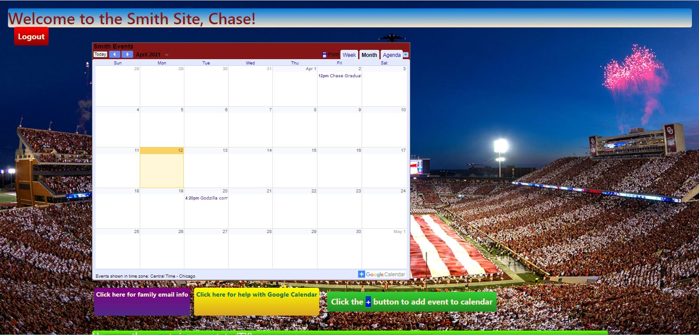

# Smith-Site

- This is a family planning website that I built for my father. (Family planning as in scheduling gatherings and sports events for the kiddos)
- Smith Site allows for a simple one-stop application for the family to put in events on an embedded Google Calendar, as well as see what's all going on in the Smith world.
- To login and register, validations are in place via **Spring** and **Javax**

- Website is built in **Java** within the **Spring Tool Suite** IDE.
- Employs **RESTful** routing with full CRUD functionality utilizing a **MySQL** database.
## Boomer Sooner
